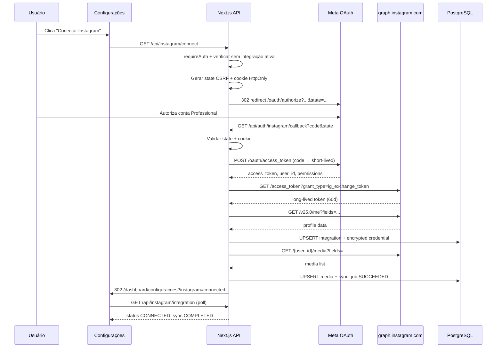

# Implementation Plan: Integração Instagram Business Login e Sincronização Inicial

**Branch**: `003-instagram-account-connection` | **Date**: 2026-07-06 | **Spec**: [spec.md](./spec.md)  
**Input**: Especificação aprovada + Constituição de Engenharia + documentação Meta (Business Login + Graph API Get Started)

## Summary

Implementar o fluxo completo de **Instagram Business Login** para usuários autenticados com conta `ACTIVE`, iniciado na página **Configurações** (`/dashboard/configuracoes`). O fluxo segue a documentação oficial Meta: autorização → troca de code → short-lived token → long-lived token (60 dias) → persistência criptografada → sincronização inicial de perfil e mídia → associação ao tenant da sessão.

A arquitetura reutiliza os padrões da feature 001 (Supabase Auth, Prisma, RLS, `requireAuth`, `assertTenantOwnership`) e adiciona domínio `lib/instagram/` isolado para OAuth, criptografia de tokens, cliente Graph API e sincronização.

---

## Technical Context

| Item | Valor |
|------|-------|
| **Language/Version** | TypeScript 5.7.x, `strict: true` |
| **Framework** | Next.js 16.x (App Router) |
| **Primary Dependencies** | `@prisma/client`, `zod`, `crypto` (Node.js) |
| **Storage** | Supabase PostgreSQL |
| **Auth (app)** | Supabase Auth (sessão existente) |
| **Auth (Instagram)** | Meta Instagram Business Login OAuth 2.0 |
| **External API** | Instagram Graph API (`graph.instagram.com`) |
| **ORM / Migrations** | Prisma 7.x + SQL RLS |
| **Testing** | Vitest + Testing Library + Playwright |
| **Target Platform** | Vercel (web + Cron) |
| **Performance Goals** | Redirect OAuth ≤3s; callback completo ≤25s; polling sync 2s interval |
| **Constraints** | Tokens nunca no frontend; uma IG por tenant; Prisma-only DDL |
| **Scale/Scope** | 4 tabelas Instagram + Route Handlers + UI Configurações |

---

## Constitution Check

_GATE: Avaliado antes e após design. Nenhuma violação não justificada._

| Princípio | Status | Como o plano atende |
|-----------|--------|---------------------|
| **1 — Qualidade de Código** | ✅ | Domínio `lib/instagram/` com funções CQS: `buildAuthorizationUrl`, `exchangeCodeForTokens`, `syncInstagramProfile` |
| **2 — Segurança de Tipos** | ✅ | Enums Prisma + `types/instagram.ts`; Zod para query/body; switch exaustivo em status |
| **3 — Padrões de Testes** | ✅ | Unit (crypto, oauth state), integration (handlers), authorization (token leak, tenant isolation), RLS |
| **4 — Consistência UX** | ✅ | Reutiliza `components/ui/`; estados loading/success/error em Configurações; pt-BR |
| **5 — Performance** | ✅ | Sync com timeout + polling; refresh token via cron assíncrono |
| **6 — Manutenibilidade** | ✅ | Módulos desacoplados; migrations versionadas; contrato OpenAPI |

**Exceções documentadas**: Nenhuma.

---

## Project Structure

### Documentation (this feature)

```text
specs/003-instagram-account-connection/
├── plan.md              ← este arquivo
├── research.md          ← decisões técnicas (Meta OAuth, crypto, RLS)
├── data-model.md        ← schema Prisma + RLS
├── quickstart.md        ← setup local e Meta Dashboard
├── contracts/
│   └── instagram-api.yaml
├── checklists/
│   └── requirements.md
└── tasks.md             ← gerado por /speckit.tasks
```

### Source Code (repository root)

```text
app/
├── api/
│   ├── instagram/
│   │   ├── connect/route.ts          # GET — inicia OAuth
│   │   ├── integration/route.ts      # GET — status público (sem tokens)
│   │   ├── sync/route.ts             # POST — retry sync
│   │   └── disconnect/route.ts       # POST — desconectar
│   ├── auth/
│   │   └── instagram/
│   │       └── callback/route.ts     # GET — callback Meta OAuth
│   └── cron/
│       └── instagram/
│           └── refresh-tokens/route.ts # POST — cron refresh
└── dashboard/
    └── configuracoes/
        └── page.tsx                  # Evoluir: card Instagram real

components/
├── instagram/
│   ├── instagram-connect-card.tsx    # Card de conexão na Configurações
│   ├── instagram-connect-button.tsx  # Botão "Conectar Instagram"
│   ├── instagram-sync-status.tsx     # Estado de sincronização
│   └── instagram-profile-summary.tsx # Dados conectados
└── ui/                               # Existente (reutilizar)

lib/
├── instagram/
│   ├── config.ts                     # Env validation (Zod)
│   ├── oauth.ts                      # buildAuthUrl, exchangeCode, refreshToken
│   ├── oauth-state.ts                # sign/verify state CSRF
│   ├── token-crypto.ts               # AES-256-GCM encrypt/decrypt
│   ├── graph-client.ts               # GET /me, /{id}/media
│   ├── integration-service.ts        # persist, disconnect, getPublic
│   ├── sync-service.ts               # runInitialSync, runSync
│   └── schemas.ts                    # Zod schemas
├── auth/
│   ├── require-auth.ts               # Existente — reutilizar
│   └── tenant-scope.ts               # Existente — reutilizar
└── db/
    └── prisma.ts                       # Existente

types/
└── instagram.ts                      # IntegrationPublic, OAuth types

prisma/
├── schema.prisma                     # + models Instagram
└── migrations/
    └── YYYYMMDD_instagram_integration/

tests/
├── unit/instagram/
│   ├── oauth-state.test.ts
│   ├── token-crypto.test.ts
│   └── graph-client.test.ts
├── integration/instagram/
│   ├── connect.test.ts
│   ├── callback.test.ts
│   ├── integration.test.ts
│   ├── disconnect.test.ts
│   ├── sync.test.ts
│   └── tenant-isolation.test.ts
└── e2e/
    └── instagram-connect.spec.ts
```

**Structure Decision**: Monolito Next.js; domínio Instagram isolado em `lib/instagram/` e `components/instagram/`. Callback em `/api/auth/instagram/callback` conforme URI registrada na Meta.

---

## 1. Architecture Overview

```text
┌─────────────────────────────────────────────────────────────────────────┐
│  Configurações (/dashboard/configuracoes)                                │
│  InstagramConnectCard → GET /api/instagram/connect (redirect)           │
│  Polling GET /api/instagram/integration (sync status)                   │
└───────────────────────────────┬─────────────────────────────────────────┘
                                │ cookies Supabase (sessão app)
┌───────────────────────────────▼─────────────────────────────────────────┐
│  Route Handlers                                                          │
│  requireAuth() → TenantContext → integration-service / sync-service      │
│  callback: verify state → oauth.exchange → persist → sync → redirect     │
└──────────┬──────────────────────────────┬───────────────────────────────┘
           │                              │
┌──────────▼──────────┐       ┌───────────▼───────────────────────────────┐
│  Meta OAuth          │       │  Prisma (server-side)                      │
│  instagram.com       │       │  WHERE tenantId = ctx.tenantId               │
│  api.instagram.com   │       │  instagram_integrations + credentials        │
│  graph.instagram.com │       └───────────┬───────────────────────────────┘
└─────────────────────┘                   │
                              ┌─────────────▼─────────────────────────────┐
                              │  Supabase PostgreSQL + RLS                   │
                              │  current_tenant_id() em tabelas públicas     │
                              │  credentials: sem policy authenticated       │
                              └─────────────────────────────────────────────┘
```

### Camadas de responsabilidade

| Camada | Responsabilidade |
|--------|------------------|
| **UI** | Estados de conexão/sync; nunca exibe tokens |
| **Route Handlers** | Auth, validação, orquestração, redirects |
| **lib/instagram/** | OAuth, Graph API, crypto, sync (lógica pura testável) |
| **Prisma** | Persistência com filtro `tenantId` |
| **RLS** | Defesa em profundidade para acesso via Supabase client |

---

## 2. OAuth Sequence Diagram



### Fluxos de erro OAuth

| Cenário Meta | Query params | Ação |
|--------------|--------------|------|
| Usuário cancela | `error=access_denied` | Redirect `?instagram=denied` — mensagem amigável |
| Code inválido/usado | OAuthException 400 | Redirect `?instagram=error` — log interno |
| State inválido | — | Redirect `?instagram=invalid_state` — 403 log |
| Conta não Professional | `account_type` inválido | Redirect `?instagram=unsupported_account` |

---

## 3. Database Design

Ver schema completo: [data-model.md](./data-model.md)

### Modelos Prisma

| Modelo | Propósito |
|--------|-----------|
| `InstagramIntegration` | Conexão tenant ↔ IG; snapshot de perfil; status |
| `InstagramCredential` | Token long-lived criptografado; expiração; escopos |
| `InstagramMedia` | Mídias para pipeline de Insights |
| `InstagramSyncJob` | Auditoria de execuções de sync |

### Relacionamentos

```text
Tenant 1──0..1── InstagramIntegration 1──1── InstagramCredential
                      │
                      ├──1:N── InstagramMedia
                      └──1:N── InstagramSyncJob
```

### Índices críticos

- `instagram_integrations.tenant_id` UNIQUE — uma integração por tenant
- `instagram_integrations.instagram_professional_id` UNIQUE — anti-duplicata global
- `instagram_credentials.token_expires_at` — query do cron de refresh
- `instagram_media(integration_id, external_media_id)` UNIQUE — idempotência

### Token storage strategy

1. Long-lived token recebido do Graph API.
2. `encryptToken(plain)` → AES-256-GCM com `INSTAGRAM_TOKEN_ENCRYPTION_KEY`.
3. Persistir em `access_token_enc`; `token_expires_at = now() + expires_in`.
4. Leitura apenas em `lib/instagram/integration-service.ts` via `decryptToken`.
5. Nunca incluir em `select` de endpoints públicos.

### Audit fields

Todas as tabelas: `created_at`, `updated_at`. Integração adicional: `connected_at`, `disconnected_at`, `connected_by_user_id`. Jobs: `started_at`, `completed_at`, `error_code`.

---

## 4. Prisma Migration Strategy

### Abordagem

1. Expandir `prisma/schema.prisma` com enums e 4 modelos (ver data-model.md).
2. Adicionar relação `Tenant.instagramIntegration`.
3. `pnpm prisma migrate dev --name instagram_integration_tables`.
4. Na mesma migration, SQL customizado:
   - `ENABLE ROW LEVEL SECURITY` + `FORCE ROW LEVEL SECURITY`
   - Policies tenant-owned para `instagram_integrations`, `instagram_media`, `instagram_sync_jobs`
   - RLS em `instagram_credentials` **sem policies** para `authenticated`
5. `pnpm prisma generate`.
6. Validar via Supabase MCP: `list_tables`, `get_advisors`.

### Regras

- **Nunca** DDL manual fora de migrations Prisma.
- Migrations idempotentes; revisadas em PR.
- `prisma migrate deploy` em staging/produção.

### Sequência

| # | Nome | Conteúdo |
|---|------|----------|
| M3 | `instagram_integration_tables` | Enums, 4 tabelas, FKs, indexes |
| M4 | `instagram_rls_policies` | Policies RLS (pode ser parte de M3) |

---

## 5. API Implementation Sequence

| Step | Task | Depends On |
|------|------|------------|
| B1 | `lib/instagram/config.ts` — validação Zod de env vars Meta | — |
| B2 | `lib/instagram/token-crypto.ts` — encrypt/decrypt AES-256-GCM | B1 |
| B3 | `lib/instagram/oauth-state.ts` — sign/verify state HMAC | B1 |
| B4 | `lib/instagram/oauth.ts` — buildAuthUrl, exchangeCode, exchangeLongLived, refresh | B1 |
| B5 | `lib/instagram/graph-client.ts` — getMe, getMedia | B4 |
| B6 | Migration Prisma + RLS | B1 |
| B7 | `types/instagram.ts` — tipos públicos | B6 |
| B8 | `lib/instagram/integration-service.ts` — persist, getPublic, disconnect | B2, B6 |
| B9 | `lib/instagram/sync-service.ts` — runInitialSync, runSync | B5, B8 |
| B10 | `GET /api/instagram/connect` | B3, B4, B8 |
| B11 | `GET /api/auth/instagram/callback` | B4, B8, B9 |
| B12 | `GET /api/instagram/integration` | B8 |
| B13 | `POST /api/instagram/sync` | B9 |
| B14 | `POST /api/instagram/disconnect` | B8 |
| B15 | `POST /api/cron/instagram/refresh-tokens` | B4, B8 |
| B16 | Testes unitários lib/instagram | B2-B9 |
| B17 | Testes integration handlers | B10-B15 |

---

## 6. Frontend Implementation Sequence

| Step | Task | Depends On |
|------|------|------------|
| F1 | `InstagramConnectCard` — substituir mock em `configuracoes/page.tsx` | B12 |
| F2 | Botão "Conectar Instagram" → `window.location = '/api/instagram/connect'` | B10 |
| F3 | `InstagramSyncStatus` — polling `GET /api/instagram/integration` a cada 2s quando `IN_PROGRESS` | B12 |
| F4 | `InstagramProfileSummary` — foto, @username, seguidores, status | B12 |
| F5 | Estados: loading (redirect OAuth), success (`?instagram=connected`), error (query params) | B11 |
| F6 | Botão "Desconectar" + confirmação → `POST /api/instagram/disconnect` | B14 |
| F7 | Estado `REQUIRES_RECONNECTION` — banner + botão "Reconectar" | B10 |
| F8 | Acessibilidade: labels, aria-live para sync, contraste WCAG AA | F1-F7 |
| F9 | E2E Playwright — fluxo conectado/desconectado (mock OAuth) | B17 |

### Query params pós-callback (redirect para Configurações)

| Param | UI |
|-------|-----|
| `instagram=connected` | Toast sucesso + iniciar polling sync |
| `instagram=denied` | Alerta: autorização cancelada |
| `instagram=unsupported_account` | Alerta: apenas contas Professional |
| `instagram=already_connected` | Alerta: tenant já possui integração |
| `instagram=error` | Alerta genérico + tentar novamente |

---

## 7. Synchronization Workflow

### Trigger

1. **Automático**: após callback OAuth bem-sucedido (`runInitialSync`).
2. **Manual retry**: `POST /api/instagram/sync` quando `syncStatus = FAILED`.
3. **Pós-reconexão**: callback OAuth em integração existente `REQUIRES_RECONNECTION`.

### Etapas `runInitialSync(integrationId, tenantId)`

```text
1. Criar InstagramSyncJob (INITIAL, RUNNING)
2. Atualizar integration.syncStatus = IN_PROGRESS
3. decryptToken → accessToken
4. GET /v25.0/me?fields=user_id,username,name,account_type,profile_picture_url,
         followers_count,follows_count,media_count
5. Validar account_type ∈ {Business, Media_Creator}
6. UPDATE instagram_integrations (campos de perfil)
7. GET /v25.0/{user_id}/media?fields=id,media_type,caption,permalink,thumbnail_url,timestamp
8. UPSERT instagram_media (por external_media_id)
9. UPDATE syncStatus=COMPLETED, lastSyncedAt=now()
10. Job status=SUCCEEDED
```

### Tratamento de falhas

- Erro API Meta (401/403): `status=REQUIRES_RECONNECTION`, `syncStatus=FAILED`.
- Erro rede/5xx: `syncStatus=FAILED`, dados parciais preservados, retry disponível.
- Timeout (>25s no callback): job permanece `RUNNING`, redirect com polling.

### Pipeline futuro (fora do escopo imediato)

- `InstagramMedia` + token válido → endpoints Insights por mídia/conta.
- Sync incremental via cron + cursor de paginação Meta.

---

## 8. Security Strategy

### OAuth state (CSRF)

```typescript
// lib/instagram/oauth-state.ts
interface OAuthStatePayload {
  tenantId: string;
  userId: string;
  nonce: string;
  exp: number; // Unix ms, +10 min
}
// state = base64url(JSON) + '.' + hmacSHA256(payload, INSTAGRAM_OAUTH_STATE_SECRET)
// Cookie instagram_oauth_state = mesmo nonce, HttpOnly, Secure, SameSite=Lax, Max-Age=600
```

Callback valida: assinatura HMAC + exp + nonce cookie match + sessão ativa do mesmo userId/tenantId.

### Server-side token exchange

- `client_secret` apenas em `lib/instagram/oauth.ts` (server).
- `exchangeCodeForTokens` e `exchangeLongLivedToken` nunca importados em Client Components.

### Encryption at rest

- AES-256-GCM; IV aleatório por token; auth tag validado no decrypt.
- Rotação de chave: feature futura (re-encrypt migration).

### Long-lived token refresh

- Cron diário 03:00 UTC: tokens com `token_expires_at <= now() + 14 days` e `age >= 24h`.
- `GET graph.instagram.com/refresh_access_token?grant_type=ig_refresh_token`.
- Falha → `REQUIRES_RECONNECTION`.

### Duplicate connection protection

- Check pré-redirect em `/connect`: integração `CONNECTED` existente → 409.
- UNIQUE constraints no DB.
- Reconexão: UPDATE registro existente `REQUIRES_RECONNECTION` / `DISCONNECTED`.

### Secret management

| Secret | Armazenamento |
|--------|---------------|
| `INSTAGRAM_APP_SECRET` | Vercel env (server) |
| `INSTAGRAM_TOKEN_ENCRYPTION_KEY` | Vercel env (server) |
| `INSTAGRAM_OAUTH_STATE_SECRET` | Vercel env (server) |
| `CRON_SECRET` | Vercel env; header `Authorization: Bearer {CRON_SECRET}` |

### Error recovery

| Erro | Recuperação |
|------|-------------|
| Token expirado | Cron refresh ou reconexão manual |
| Token revogado | `REQUIRES_RECONNECTION` + UI reconectar |
| Sync falhou | `POST /api/instagram/sync` |
| OAuth negado | Reiniciar fluxo; sem alteração de DB |

### Security Checklist

- [ ] Nenhum token em response JSON, HTML ou logs
- [ ] `INSTAGRAM_*` sem prefixo `NEXT_PUBLIC_`
- [ ] RLS habilitado + forced em tabelas Instagram
- [ ] `instagram_credentials` sem policy authenticated
- [ ] `state` validado em todo callback
- [ ] `requireAuth` em todos endpoints exceto callback e cron
- [ ] Cron protegido por `CRON_SECRET`
- [ ] `get_advisors` sem alertas críticos pós-deploy

---

## 9. Multi-Tenant Strategy

### Database

- `tenant_id` NOT NULL em `instagram_integrations`, `instagram_media`, `instagram_sync_jobs`, `instagram_credentials`.
- RLS: `tenant_id = current_tenant_id()` em tabelas com acesso client.
- UNIQUE `(tenant_id)` em integrações.

### API

```typescript
export const GET = requireAuth(async (_req, ctx) => {
  const integration = await prisma.instagramIntegration.findUnique({
    where: { tenantId: ctx.tenantId }, // NUNCA ctx do body
  });
  return toPublicResponse(integration);
});
```

### Business logic

- `integration-service.getById(id, ctx)`: fetch + `assertTenantOwnership(ctx, row.tenantId)`.
- Sync jobs recebem `tenantId` do contexto, não do parâmetro externo.

### Background synchronization

- Cron refresh: itera credenciais com join em integrações; cada update filtrado por `integration.tenantId`.
- Futuro worker: payload inclui `tenantId` validado contra integração.

### Defense in depth

```text
Request → middleware (sessão) → requireAuth (ACTIVE)
  → assertTenantOwnership → Prisma WHERE tenantId
  → RLS (Supabase client) → Response sem tokens
```

---

## 10. Testing Strategy

### Stack

| Tipo | Ferramenta | Escopo |
|------|-----------|--------|
| Unitário | Vitest | oauth-state, token-crypto, oauth URL builder, graph-client (mock fetch) |
| Integração | Vitest | Route Handlers com Prisma test DB / mocks |
| OAuth callback | Vitest | state válido/inválido, code exchange mock, redirect URLs |
| API | Vitest | integration, disconnect, sync, error codes |
| Token lifecycle | Vitest | encrypt/decrypt roundtrip, refresh mock, expiry → RECONNECTION |
| Authorization | Vitest | responses não contêm `access_token`; 401 sem sessão |
| Multi-tenant | Vitest | User A não acessa integração Tenant B |
| RLS | Vitest + Supabase client | 2 sessões; SELECT cross-tenant falha |
| E2E | Playwright | Configurações UI states (mock API) |

### Cenários obrigatórios

**OAuth**:
- Connect autenticado → redirect Meta URL correta
- Connect não autenticado → 401
- Callback state inválido → redirect erro
- Callback `access_denied` → redirect denied
- Callback sucesso → integração CONNECTED no tenant correto

**Sincronização**:
- Initial sync persiste perfil + mídia
- Conta `Media_Creator` aceita; pessoal rejeita
- Falha API → syncStatus FAILED, dados parciais OK
- Retry sync → novo job SUCCEEDED

**Tokens**:
- Credential row contém ciphertext, não plaintext
- GET /integration não retorna campos de token
- Refresh cron atualiza `token_expires_at`

**Multi-tenant**:
- Tenant A conecta IG → Tenant B não vê dados
- Mesmo `instagram_professional_id` em Tenant B → erro ACCOUNT_LINKED_ELSEWHERE

**Desconexão**:
- Status DISCONNECTED; sync não executa
- Reconexão reutiliza mesmo `integration.id`

### Coverage mínima

- `lib/instagram/*`: 90%+
- Route Handlers Instagram: 100% happy + error paths
- RLS: 1 test SELECT cross-tenant por tabela pública

---

## 11. API Architecture (Detalhamento por Endpoint)

Ver contrato: [contracts/instagram-api.yaml](./contracts/instagram-api.yaml)

### `GET /api/instagram/connect`

| Aspecto | Detalhe |
|---------|---------|
| **Responsabilidade** | Iniciar OAuth; gerar state; redirect Meta |
| **Auth** | `requireAuth` — usuário ACTIVE |
| **Validação** | Sem integração CONNECTED existente para tenant |
| **Input** | Nenhum body; tenantId da sessão |
| **Sucesso** | 302 → `instagram.com/oauth/authorize?...` |
| **Erros** | 401 sessão; 409 já conectado |

### `GET /api/auth/instagram/callback`

| Aspecto | Detalhe |
|---------|---------|
| **Responsabilidade** | Validar state; trocar code; long-lived token; persistir; sync inicial; redirect |
| **Auth** | Sessão opcional mas state deve corresponder ao userId/tenantId da sessão ativa |
| **Validação** | `state` HMAC; `code` presente; cookie nonce; redirect_uri match |
| **Sucesso** | 302 → `/dashboard/configuracoes?instagram=connected` |
| **Erros** | Redirect com query param (denied, error, unsupported_account) |

### `GET /api/instagram/integration`

| Aspecto | Detalhe |
|---------|---------|
| **Responsabilidade** | Retornar status público da integração do tenant |
| **Auth** | `requireAuth` |
| **Response** | `{ connected: boolean, integration?: IntegrationPublic }` — sem tokens |
| **Erros** | 401 |

### `POST /api/instagram/sync`

| Aspecto | Detalhe |
|---------|---------|
| **Responsabilidade** | Retry de sincronização |
| **Auth** | `requireAuth` |
| **Validação** | Integração CONNECTED ou REQUIRES_RECONNECTION; não IN_PROGRESS |
| **Sucesso** | 202 `{ jobId, syncStatus: 'IN_PROGRESS' }` |
| **Erros** | 404, 409 sync em andamento, 422 status inválido |

### `POST /api/instagram/disconnect`

| Aspecto | Detalhe |
|---------|---------|
| **Responsabilidade** | Marcar DISCONNECTED; invalidar uso de token |
| **Auth** | `requireAuth` |
| **Sucesso** | 200 `{ success: true, status: 'DISCONNECTED' }` |
| **Erros** | 404 sem integração |

### `POST /api/cron/instagram/refresh-tokens`

| Aspecto | Detalhe |
|---------|---------|
| **Responsabilidade** | Refresh proativo de tokens long-lived |
| **Auth** | Header `Authorization: Bearer ${CRON_SECRET}` |
| **Sucesso** | 200 `{ refreshed, failed, skipped }` |
| **Erros** | 401 secret inválido |

---

## 12. Ordered Implementation Tasks

_Tarefas ordenadas para geração formal via `/speckit.tasks`. IDs provisórios._

### Phase 0 — Setup

| ID | Task | Priority |
|----|------|----------|
| T001 | Adicionar env vars Meta em `.env.example` e `lib/instagram/config.ts` (Zod) | P0 |
| T002 | Gerar `INSTAGRAM_TOKEN_ENCRYPTION_KEY` e documentar em quickstart | P0 |

### Phase 1 — Database

| ID | Task | Priority |
|----|------|----------|
| T003 | Expandir `prisma/schema.prisma` com modelos Instagram | P0 |
| T004 | Migration `instagram_integration_tables` + RLS SQL | P0 |
| T005 | Validar schema via Supabase MCP `get_advisors` | P0 |
| T006 | `pnpm prisma generate` | P0 |

### Phase 2 — Core lib/instagram

| ID | Task | Priority |
|----|------|----------|
| T007 | Implementar `token-crypto.ts` + testes | P0 |
| T008 | Implementar `oauth-state.ts` + testes | P0 |
| T009 | Implementar `oauth.ts` (auth URL, code exchange, long-lived, refresh) + testes | P0 |
| T010 | Implementar `graph-client.ts` (getMe, getMedia) + testes | P0 |
| T011 | Implementar `integration-service.ts` | P0 |
| T012 | Implementar `sync-service.ts` | P0 |
| T013 | Criar `types/instagram.ts` | P0 |

### Phase 3 — API Route Handlers

| ID | Task | Priority |
|----|------|----------|
| T014 | `GET /api/instagram/connect` | P0 |
| T015 | `GET /api/auth/instagram/callback` | P0 |
| T016 | `GET /api/instagram/integration` | P0 |
| T017 | `POST /api/instagram/sync` | P1 |
| T018 | `POST /api/instagram/disconnect` | P0 |
| T019 | `POST /api/cron/instagram/refresh-tokens` + `vercel.json` cron | P1 |
| T020 | Testes integration todos handlers | P0 |

### Phase 4 — Frontend Configurações

| ID | Task | Priority |
|----|------|----------|
| T021 | `InstagramConnectCard` + integrar em `configuracoes/page.tsx` | P0 |
| T022 | Polling sync status + estados loading/success/error | P0 |
| T023 | Disconnect + confirmação | P0 |
| T024 | Banner reconexão (`REQUIRES_RECONNECTION`) | P1 |
| T025 | Acessibilidade e pt-BR | P1 |

### Phase 5 — Testes avançados e deploy

| ID | Task | Priority |
|----|------|----------|
| T026 | Testes multi-tenant isolation | P0 |
| T027 | Testes RLS cross-tenant | P0 |
| T028 | Testes token lifecycle (no leak) | P0 |
| T029 | E2E Playwright instagram-connect.spec.ts | P1 |
| T030 | Configurar env produção Vercel + Meta redirect URI prod | P0 |
| T031 | Atualizar política de privacidade (escopos `instagram_business_*`) | P2 |

---

## Risks and Dependencies

### Dependencies

| Dependência | Status | Ação |
|-------------|--------|------|
| Auth 001 + Ativação 002 | Implementado | Reutilizar `requireAuth`, `getTenantContext` |
| Meta App + Business Login | Configurado (client_id fornecido) | Validar redirect URIs dev + prod |
| Prisma + Supabase | Operacional | Nova migration |
| Vitest | Configurado | Expandir testes |

### Risks

| Risco | Impacto | Mitigação |
|-------|---------|-----------|
| Timeout callback Vercel (30s) | Sync incompleta no redirect | Timeout 25s + polling |
| Prisma bypassa RLS | Leak cross-tenant | Filtro `tenantId` obrigatório |
| Escopos OAuth vs política privacidade | Compliance | Task T031 atualizar privacy page |
| Token expira sem cron | Sync para | Vercel Cron + UI reconexão |
| Conta IG já em outro tenant | Erro usuário | UNIQUE `instagram_professional_id` |

---

## Next Steps

1. **`/speckit.tasks`** — gerar `tasks.md` formal a partir das tarefas T001–T031.
2. **`/speckit.implement`** — executar implementação fase por fase.
