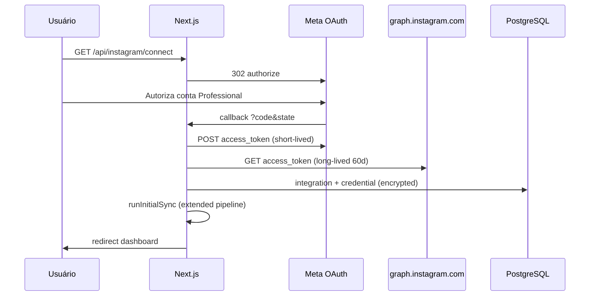

# Implementation Plan: Instagram Analytics Dashboard

**Branch**: `004-instagram-analytics-dashboard` | **Date**: 2026-07-07  
**Spec**: [spec.md](./spec.md) | **Depende de**: [003-instagram-account-connection](../003-instagram-account-connection/spec.md)  
**Input**: Specs 003+004 aprovadas + Constituição de Engenharia + documentação Meta (Business Login + Graph API Insights)

## Summary

Implementar o **módulo completo de Instagram Analytics** para Connex Insights: estender a fundação OAuth/sync da feature 003 com coleta oficial de Insights (conta, mídia, audiência), persistência histórica append-only, sincronização diária via Cron e dashboard analítico interativo consumindo exclusivamente PostgreSQL.

O dashboard **nunca** consulta a Meta diretamente. Fluxo canônico:

```text
Meta Graph API → Camadas de Sync → PostgreSQL (snapshots) → Analytics Services → Dashboard
```

**Estado atual (003 parcialmente implementado)**:
- ✅ OAuth Business Login, tokens long-lived, refresh cron, perfil `/me`, mídia primeira página
- ❌ Paginação incremental de mídia, `media_url`, Insights de conta/mídia/audiência, snapshots históricos, cron diário de sync, dashboard com dados reais

---

## Technical Context

| Item | Valor |
|------|-------|
| **Language/Version** | TypeScript 5.7.x, `strict: true` |
| **Framework** | Next.js 16.x (App Router) |
| **Primary Dependencies** | `@prisma/client`, `zod`, `recharts`, `crypto` |
| **Storage** | Supabase PostgreSQL |
| **Auth (app)** | Supabase Auth + `requireAuth` |
| **Auth (Instagram)** | Meta Instagram Business Login OAuth 2.0 |
| **External API** | Instagram Graph API `graph.instagram.com/v25.0` |
| **ORM / Migrations** | Prisma 7.x + SQL RLS |
| **Testing** | Vitest + Testing Library + Playwright |
| **Target Platform** | Vercel (web + Cron) |
| **Performance Goals** | Dashboard period change ≤3s; daily sync tenant-isolated; batch media insights |
| **Constraints** | Tokens nunca no frontend; append-only metrics; Prisma-only DDL |
| **Scale/Scope** | +1 tabela snapshots, extensão 3 tabelas, 7 serviços, 4 analytics endpoints, dashboard UI |

---

## Constitution Check

_GATE: Avaliado antes e após design. Nenhuma violação não justificada._

| Princípio | Status | Como o plano atende |
|-----------|--------|---------------------|
| **1 — Qualidade de Código** | ✅ | 7 serviços CQS em `lib/instagram/`; orquestrador fino; funções por responsabilidade |
| **2 — Segurança de Tipos** | ✅ | Enums Prisma + `types/instagram.ts` + `types/analytics.ts`; Zod em query params; switch exaustivo |
| **3 — Padrões de Testes** | ✅ | Unit (metrics, period), integration (sync, analytics API), authorization, RLS, cron |
| **4 — Consistência UX** | ✅ | Reutiliza `components/dashboard/`; skeletons; empty states; pt-BR; recharts |
| **5 — Performance** | ✅ | Cache `unstable_cache`; paginação server-side; sync incremental; índices em snapshots |
| **6 — Manutenibilidade** | ✅ | Módulos desacoplados por camada Meta; registry extensível de métricas; migrations versionadas |

**Exceções documentadas**: Nenhuma.

---

## Project Structure

### Documentation (this feature)

```text
specs/004-instagram-analytics-dashboard/
├── plan.md              ← este arquivo
├── research.md          ← decisões Meta API + snapshots
├── data-model.md        ← schema Prisma + RLS snapshots
├── quickstart.md        ← setup analytics + validação
├── contracts/
│   └── instagram-analytics-api.yaml
├── checklists/
│   └── requirements.md
└── tasks.md             ← gerado por /speckit.tasks
```

### Source Code (repository root — delta sobre 003)

```text
app/
├── api/
│   ├── instagram/
│   │   ├── analytics/
│   │   │   ├── overview/route.ts
│   │   │   ├── timeseries/route.ts
│   │   │   ├── media/route.ts
│   │   │   ├── audience/route.ts
│   │   │   └── sync-status/route.ts
│   │   └── ... (connect, integration, sync, disconnect — 003)
│   └── cron/
│       └── instagram/
│           ├── refresh-tokens/route.ts    # existente
│           ├── daily-sync/route.ts        # novo
│           └── purge-metrics/route.ts     # novo (retenção 90d)
└── dashboard/
    └── page.tsx                           # evoluir: dados reais Instagram

components/
├── dashboard/
│   ├── metric-cards.tsx                   # evoluir: props reais
│   ├── charts-section.tsx
│   ├── top-posts.tsx
│   ├── audience-section.tsx
│   ├── date-range-picker.tsx              # novo
│   ├── sync-status-banner.tsx             # novo
│   └── instagram-empty-state.tsx          # novo
└── instagram/                             # existente (003)

lib/
├── instagram/
│   ├── auth/                              # refatoração opcional de oauth/*
│   │   └── token-service.ts               # InstagramTokenService
│   ├── account/
│   │   └── account-service.ts             # InstagramAccountService
│   ├── media/
│   │   └── media-service.ts               # InstagramMediaService
│   ├── insights/
│   │   ├── insights-service.ts            # InstagramInsightsService
│   │   ├── account-insights.ts
│   │   ├── media-insights.ts
│   │   ├── audience-insights.ts
│   │   └── metrics/
│   │       ├── registry.ts                # métricas por scope/media_type
│   │       └── parser.ts                  # normaliza resposta Meta → snapshots
│   ├── sync/
│   │   ├── synchronization-service.ts     # InstagramSynchronizationService
│   │   └── phases/                        # account, media, insights, audience
│   ├── cron/
│   │   └── cron-service.ts                # InstagramCronService
│   ├── analytics/
│   │   ├── overview-query.ts
│   │   ├── timeseries-query.ts
│   │   ├── media-query.ts
│   │   ├── audience-query.ts
│   │   ├── period.ts                      # 7d, 30d, 90d, 6m, 12m
│   │   └── trend.ts                       # changePercent, trend direction
│   ├── graph-client.ts                    # estender: insights, paginação
│   ├── sync-service.ts                    # delegar para synchronization-service
│   └── ... (oauth, config, etc. — 003)
└── analytics/
    └── format-metric.ts                   # utilitários cross-platform futuros

types/
├── instagram.ts                           # estender
└── analytics.ts                           # novo

prisma/
└── migrations/
    └── YYYYMMDD_instagram_analytics_snapshots/

tests/
├── unit/instagram/
│   ├── metrics-parser.test.ts
│   ├── period.test.ts
│   └── trend.test.ts
├── integration/instagram/
│   ├── account-insights-sync.test.ts
│   ├── media-insights-sync.test.ts
│   ├── daily-sync-cron.test.ts
│   ├── analytics-overview.test.ts
│   ├── analytics-tenant-isolation.test.ts
│   └── metric-snapshots-idempotency.test.ts
└── e2e/
    └── instagram-dashboard.spec.ts
```

**Structure Decision**: Monolito Next.js; serviços Instagram em subpastas por camada Meta oficial. Analytics queries separadas de sync. Dashboard via Server Components + client islands para interatividade (period picker, sort).

---

## 1. Overall System Architecture

```text
┌──────────────────────────────────────────────────────────────────────────────┐
│                         DASHBOARD (/dashboard)                                │
│  Server Components → lib/instagram/analytics/* → Prisma snapshots           │
│  Client islands: DateRangePicker, sort, compare toggle                         │
└───────────────────────────────────┬──────────────────────────────────────────┘
                                    │ GET /api/instagram/analytics/* (client fetch)
┌───────────────────────────────────▼──────────────────────────────────────────┐
│                    ANALYTICS SERVICES (read-only)                             │
│  overview-query │ timeseries-query │ media-query │ audience-query            │
└───────────────────────────────────┬──────────────────────────────────────────┘
                                    │ SELECT snapshots (tenant_id filter)
┌───────────────────────────────────▼──────────────────────────────────────────┐
│                    PostgreSQL + RLS                                             │
│  instagram_metric_snapshots │ instagram_media │ instagram_integrations       │
└───────────────────────────────────▲──────────────────────────────────────────┘
                                    │ INSERT snapshots (append-only)
┌───────────────────────────────────┴──────────────────────────────────────────┐
│              SYNCHRONIZATION PIPELINE (write-only)                              │
│  InstagramSynchronizationService                                                │
│    ├─ InstagramAccountService      (GET /me)                                   │
│    ├─ InstagramMediaService        (GET /media, paginated)                       │
│    ├─ InstagramInsightsService     (GET /insights account + media)             │
│    └─ audience phase               (follower_demographics, online_followers)    │
└───────────────────────────────────▲──────────────────────────────────────────┘
                                    │ Instagram User Access Token (decrypted)
┌───────────────────────────────────┴──────────────────────────────────────────┐
│              AUTHENTICATION LAYER (no Insights)                                 │
│  InstagramTokenService: OAuth, exchange, refresh, encrypt                     │
└───────────────────────────────────▲──────────────────────────────────────────┘
                                    │
┌───────────────────────────────────┴──────────────────────────────────────────┐
│  Meta: instagram.com/oauth │ api.instagram.com │ graph.instagram.com           │
└──────────────────────────────────────────────────────────────────────────────┘
```

### Módulos independentes e responsabilidades

| Serviço | Arquivo | Responsabilidade | Coleta Insights? |
|---------|---------|------------------|------------------|
| **InstagramAuthService** | `oauth.ts`, `oauth-state.ts` | OAuth redirect, code exchange | ❌ |
| **InstagramTokenService** | `token-service.ts`, `token-crypto.ts` | Encrypt/decrypt, refresh, expiry | ❌ |
| **InstagramAccountService** | `account/account-service.ts` | GET `/me`, update integration | ❌ |
| **InstagramMediaService** | `media/media-service.ts` | GET `/media`, paginação, soft delete | ❌ |
| **InstagramInsightsService** | `insights/insights-service.ts` | GET `/insights` conta e mídia | ✅ |
| **InstagramSynchronizationService** | `sync/synchronization-service.ts` | Orquestra fases, jobs, idempotência | Orquestra |
| **InstagramCronService** | `cron/cron-service.ts` | Daily sync, purge, token refresh | Orquestra |

---

## 2. OAuth Authentication Flow

_Reutiliza implementação 003 — sem alteração de arquitetura._



**Regras inalteradas (003)**:
- `state` HMAC + cookie double-submit
- `client_secret` apenas server-side
- Long-lived token imediatamente após code exchange
- Callback dispara **sync completa** (não apenas perfil+mídia)

**Delta 004**: `runInitialSync` passa a executar pipeline completo (account → media → account insights → media insights → audience).

---

## 3. Synchronization Pipeline

### 3.1 Fases do pipeline (ordem oficial)

```text
Phase 1 — AccountSync
  GET /v25.0/me
  UPDATE instagram_integrations (perfil, followers, etc.)

Phase 2 — MediaSync (incremental)
  GET /v25.0/{user_id}/media?fields=...&after={cursor}
  UPSERT instagram_media (unique integration_id + external_media_id)
  UPDATE media_sync_cursor
  Soft-delete mídias ausentes (reconcile semanal)

Phase 3 — AccountInsightsSync
  Para cada métrica elegível (registry):
    GET /v25.0/{user_id}/insights?metric={m}&period=day&since&until
  INSERT instagram_metric_snapshots (scope=ACCOUNT)

Phase 4 — MediaInsightsSync
  Para cada mídia ativa (batch):
    GET /v25.0/{media_id}/insights?metric={m}
  INSERT instagram_metric_snapshots (scope=MEDIA)

Phase 5 — AudienceInsightsSync
  GET /insights?metric=follower_demographics&breakdown=...
  GET /insights?metric=online_followers
  INSERT instagram_metric_snapshots (scope=AUDIENCE)

Phase 6 — Finalize
  UPDATE integration.lastSyncedAt, syncStatus
  UPDATE sync_job (counts, duration, status SUCCEEDED|PARTIAL|FAILED)
  revalidateTag(`instagram-analytics-{tenantId}`)
```

### 3.2 Initial vs Daily Sync

| Aspecto | Initial (`INITIAL`) | Daily (`INCREMENTAL`) |
|---------|---------------------|------------------------|
| **Trigger** | Pós-OAuth callback | Cron `0 4 * * *` UTC |
| **Account** | Full profile | Refresh profile |
| **Media** | Full pagination | Incremental + cursor |
| **Insights** | Últimos 90 dias (`since`) | Últimos 2 dias (overlap para completude) |
| **Audience** | Full | Refresh |
| **Job type** | `INITIAL` | `INCREMENTAL` |

### 3.3 Idempotência

- Cada execução cria **um** `InstagramSyncJob` com UUID único.
- Snapshots: `UNIQUE (sync_job_id, scope, entity_id, metric_name, period, metric_date, breakdown_*)`.
- Retry do mesmo job (falha de rede mid-phase): verificar snapshots existentes para `sync_job_id` antes de re-inserir.
- Re-execução de novo job no mesmo dia: **novos** snapshots com `collected_at` distinto — histórico preservado.

### 3.4 Isolamento entre tenants

Cron itera integrações `CONNECTED` com `for...of` e try/catch **por tenant** — falha em tenant A não interrompe tenant B.

```typescript
for (const integration of integrations) {
  try {
    await runSync(integration.id, { jobType: 'INCREMENTAL' });
  } catch (error) {
    logger.error({ tenantId: integration.tenantId, error });
    // continua próximo tenant
  }
}
```

---

## 4. Database Design

Ver schema completo: [data-model.md](./data-model.md)

### Modelos

| Modelo | Propósito |
|--------|-----------|
| `InstagramIntegration` | Conta + cursor sync + metadata (estendido) |
| `InstagramCredential` | Tokens criptografados (003, inalterado) |
| `InstagramMedia` | Publicações + `media_url` + soft delete (estendido) |
| `InstagramSyncJob` | Logs estruturados + contadores (estendido) |
| `InstagramMetricSnapshot` | **Novo** — histórico append-only extensível |

### Historical Data Strategy

| Conceito | Implementação |
|----------|---------------|
| **Snapshot strategy** | INSERT por sync job; nunca UPDATE |
| **Time-series** | `metric_date` + `metric_name` + `scope` |
| **Metric versioning** | Múltiplos snapshots por dia via `collected_at` |
| **Retention** | 90 dias; cron purge diário |
| **Granularity** | `day` para charts 7d-90d; agregação SQL para 6m/12m |
| **Meta deprecation** | Valores antigos permanecem em snapshots mesmo se API parar de expor |

---

## 5. Prisma Migration Strategy

### Sequência

| # | Nome | Conteúdo |
|---|------|----------|
| M5 | `instagram_analytics_snapshots` | Enum scope, tabela snapshots, alter media/integration/sync_jobs |
| M6 | `instagram_analytics_rls` | RLS em `instagram_metric_snapshots` |
| M7 | `instagram_sync_job_partial` | Enum value `PARTIAL` |

### Procedimento

1. Atualizar `prisma/schema.prisma` conforme [data-model.md](./data-model.md).
2. `pnpm prisma migrate dev --name instagram_analytics_snapshots`.
3. SQL customizado na migration: RLS policies.
4. `pnpm prisma generate`.
5. Supabase MCP: `list_tables`, `get_advisors`.
6. Backfill: `POST /api/instagram/sync` ou cron manual para tenants existentes.

**Regras**: Nunca DDL manual fora de migrations Prisma.

---

## 6. API Architecture

### 6.1 Sync & Auth APIs (003 — manutenção)

Sem breaking changes. `POST /api/instagram/sync` passa a disparar pipeline completo.

### 6.2 Analytics APIs (004 — novos)

Contrato: [contracts/instagram-analytics-api.yaml](./contracts/instagram-analytics-api.yaml)

| Endpoint | Responsabilidade | Auth |
|----------|------------------|------|
| `GET /api/instagram/analytics/overview` | KPIs + compare | `requireAuth` |
| `GET /api/instagram/analytics/timeseries` | Série temporal | `requireAuth` |
| `GET /api/instagram/analytics/media` | Conteúdo paginado | `requireAuth` |
| `GET /api/instagram/analytics/audience` | Demografia | `requireAuth` |
| `GET /api/instagram/analytics/sync-status` | Frescor + status | `requireAuth` |

**Padrão handler**:

```typescript
export const GET = requireAuth(async (req, ctx) => {
  const period = parsePeriod(req.nextUrl.searchParams.get('period'));
  const data = await getOverviewAnalytics(ctx.tenantId, period);
  return NextResponse.json(data);
});
```

- `tenantId` exclusivamente de `ctx.tenantId`.
- Respostas sem tokens, sem dados de outros tenants.
- Zod valida query params; erros 400 com mensagens pt-BR.

### 6.3 Graph API Client extensions

`lib/instagram/graph-client.ts` — novas funções:

| Função | Endpoint Meta |
|--------|---------------|
| `getInstagramMediaPage(id, token, after?)` | `/{id}/media` com paginação |
| `getAccountInsights(id, token, params)` | `/{id}/insights` |
| `getMediaInsights(mediaId, token, metrics)` | `/{mediaId}/insights` |
| `getAudienceInsights(id, token)` | demographics + online_followers |

Todas com retry/backoff e parsing via `insights/metrics/parser.ts`.

---

## 7. Cron Job Architecture

### Jobs Vercel (`vercel.json`)

| Schedule | Path | Responsabilidade |
|----------|------|------------------|
| `0 3 * * *` | `/api/cron/instagram/refresh-tokens` | Token refresh (003) |
| `0 4 * * *` | `/api/cron/instagram/daily-sync` | Sync incremental todas integrações CONNECTED |
| `0 5 * * *` | `/api/cron/instagram/purge-metrics` | Remove snapshots > 90 dias |

**Auth**: `Authorization: Bearer ${CRON_SECRET}` em todos.

### InstagramCronService

```typescript
// lib/instagram/cron/cron-service.ts
export async function runDailySyncForAllTenants(): Promise<CronResult>
export async function runMetricsPurge(): Promise<PurgeResult>
export async function runTokenRefresh(): Promise<RefreshResult>  // delega existente
```

### Observabilidade por job

Cada sync popula `instagram_sync_jobs`:
- `started_at`, `completed_at`, `duration_ms`
- `media_imported_count`, `metrics_imported_count`
- `failed_requests_count`, `retry_count`
- `remaining_api_quota` (JSONB de headers Meta)
- `error_code`, `error_message` (internos)

Logs estruturados (stdout JSON):
```json
{
  "event": "instagram_sync_completed",
  "tenantId": "...",
  "integrationId": "...",
  "jobType": "INCREMENTAL",
  "durationMs": 12450,
  "mediaImported": 3,
  "metricsImported": 847,
  "failedRequests": 1
}
```

---

## 8. Dashboard Architecture

### Data flow

```text
/dashboard (Server Component)
  ├─ getOverviewAnalytics(tenantId, defaultPeriod)     → KPIs iniciais
  ├─ IntegrationBanner (sync status)
  └─ Client: DateRangePicker
        └─ fetch /api/instagram/analytics/overview?period=30d
        └─ fetch /api/instagram/analytics/timeseries?metric=reach
```

### Componentes

| Componente | Fonte de dados | Notas |
|------------|----------------|-------|
| `MetricCards` | `overview.kpis` | Trend up/down/neutral |
| `ChartsSection` | `timeseries` | recharts LineChart |
| `TopPosts` | `analytics/media` | Sort server-side |
| `AudienceSection` | `analytics/audience` | Empty se indisponível |
| `DateRangePicker` | query param `period` | 7d, 30d, 90d, 6m, 12m |
| `SyncStatusBanner` | `sync-status` | Frescor, falha sync |
| `InstagramEmptyState` | sem integração | CTA → configuracoes |

### Estados UX

| Estado | Comportamento |
|--------|---------------|
| Sem integração | `InstagramEmptyState` + link configuracoes |
| Sync IN_PROGRESS | Skeletons + banner "Sincronizando" |
| Sync FAILED | Banner acionável + dados históricos |
| REQUIRES_RECONNECTION | Banner reconectar + dados históricos |
| Métrica indisponível | Card com "Indisponível" — sem valor 0 |

### Performance

- `unstable_cache` com tags por tenant; revalidate após sync.
- Server Components para carga inicial; client fetch apenas em mudança de período.
- Paginação media: 20 itens/página default.
- Debounce 300ms em troca de período.

---

## 9. Token Lifecycle

_Reutiliza 003 + reforços documentais._

| Etapa | Implementação |
|-------|---------------|
| Short-lived exchange | `oauth.exchangeCodeForTokens` |
| Long-lived exchange | `oauth.exchangeLongLivedToken` |
| Storage | AES-256-GCM em `instagram_credentials` |
| Expiry tracking | `token_expires_at` |
| Auto renewal | Cron 03:00 UTC, tokens ≤14 dias |
| Failure | `REQUIRES_RECONNECTION` + banner dashboard |

**Regra**: Camada de Insights nunca renova token — delega a `InstagramTokenService.ensureValidToken(integrationId)` antes de cada fase de sync.

---

## 10. Security and RLS Strategy

### Camadas de defesa

```text
requireAuth (ACTIVE)
  → assertTenantOwnership
  → Prisma WHERE tenantId = ctx.tenantId
  → RLS current_tenant_id()
  → Response sem tokens/credenciais
```

### RLS (tabelas tenant-owned)

| Tabela | RLS | Policies |
|--------|-----|----------|
| `instagram_integrations` | ✅ | SELECT authenticated |
| `instagram_media` | ✅ | SELECT authenticated |
| `instagram_sync_jobs` | ✅ | SELECT authenticated |
| `instagram_metric_snapshots` | ✅ **novo** | SELECT authenticated |
| `instagram_credentials` | ✅ FORCE | Sem policy authenticated |

### Security Checklist

- [ ] Analytics endpoints filtram por `ctx.tenantId`
- [ ] Nenhum `access_token` em JSON/HTML/bundles
- [ ] `CRON_SECRET` em todos crons
- [ ] Snapshots INSERT apenas server-side (Prisma)
- [ ] `get_advisors` sem alertas críticos pós-migration
- [ ] Rate limit errors não expõem quota interna ao usuário

---

## 11. Multi-Tenant Strategy

- `tenant_id` NOT NULL em todas as tabelas Instagram incluindo snapshots.
- UNIQUE `(tenant_id)` em integrações — uma conta IG por tenant.
- UNIQUE `(instagram_professional_id)` global — mesma IG não em dois tenants.
- Cron processa integrações isoladamente.
- Cache keys incluem `tenantId`: `instagram-analytics-{tenantId}`.
- Testes obrigatórios: User A não lê snapshots de Tenant B.

---

## 12. Error Handling & Recovery

| Cenário | Estratégia |
|---------|------------|
| Token expirado | Refresh cron ou `REQUIRES_RECONNECTION` |
| Permissões revogadas | `REQUIRES_RECONNECTION`; histórico preservado |
| Rate limit 429 | Backoff exponencial (max 3); `failed_requests_count++` |
| Insight vazio | Skip métrica; log; não falha job inteiro |
| Métrica não suportada | Registry marca unsupported; skip |
| Sync falhou | `syncStatus=FAILED`; dados anteriores intactos |
| Falha parcial | `job.status=PARTIAL`; métricas importadas preservadas |
| Rede | Retry por request; job pode ser reexecutado |
| Tenant A falha no cron | Tenant B continua |

Mensagens ao usuário: pt-BR, não técnicas. Detalhes em `error_code`/`error_message` apenas no DB.

---

## 13. Testing Strategy

### Matriz de testes

| Tipo | Escopo | Arquivos |
|------|--------|----------|
| **Unitário** | period parsing, trend calc, metrics parser, registry | `tests/unit/instagram/*`, `tests/unit/analytics/*` |
| **Integração** | Sync phases, snapshot idempotency, analytics APIs | `tests/integration/instagram/*` |
| **OAuth** | Callback + initial sync extended (mock Graph) | existente + estender |
| **Sync** | Account/media/insights phases | `account-insights-sync.test.ts` |
| **Cron** | Daily sync multi-tenant isolation | `daily-sync-cron.test.ts` |
| **Authorization** | No token leak; cross-tenant 403/empty | `analytics-tenant-isolation.test.ts` |
| **RLS** | SELECT snapshots cross-tenant falha | `metric-snapshots-rls.test.ts` |
| **Token refresh** | Existente 003 | `token-refresh.test.ts` |
| **Recovery** | Partial sync, FAILED preserves data | `failure-recovery.test.ts` |
| **E2E** | Dashboard estados, period change | `instagram-dashboard.spec.ts` |

### Cenários obrigatórios

**Snapshots**:
- Initial sync cria snapshots ACCOUNT + MEDIA + AUDIENCE
- Re-run mesmo job não duplica (idempotência)
- Daily sync append novos snapshots
- Purge remove > 90 dias

**Dashboard**:
- Com integração: KPIs renderizam valores reais
- Sem integração: empty state CTA
- Period 7d/30d/90d/6m/12m retorna dados coerentes
- Métrica indisponível → status `unavailable`
- Compare period → `changePercent` correto

**Multi-tenant**:
- Tenant A snapshots invisíveis para Tenant B em API e RLS

### Coverage mínima

- `lib/instagram/insights/*`: 90%+
- `lib/instagram/analytics/*`: 90%+
- Analytics Route Handlers: 100% happy + error paths
- RLS snapshots: 1 test cross-tenant

---

## 14. Ordered Implementation Tasks

_Tarefas ordenadas para geração formal via `/speckit.tasks`. IDs provisórios._

### Phase 0 — Prerequisites (gap 003)

| ID | Task | Priority | Depends |
|----|------|----------|---------|
| T001 | Validar OAuth + env vars Meta operacionais (003 T003, T030) | P0 | — |
| T002 | Confirmar migration 003 aplicada em Supabase | P0 | — |

### Phase 1 — Database & Types

| ID | Task | Priority | Depends |
|----|------|----------|---------|
| T003 | Atualizar `prisma/schema.prisma` com snapshots + campos estendidos | P0 | T002 |
| T004 | Migration `instagram_analytics_snapshots` + RLS | P0 | T003 |
| T005 | Adicionar `PARTIAL` a `InstagramSyncJobStatus` | P0 | T003 |
| T006 | `pnpm prisma generate` | P0 | T004 |
| T007 | Criar `types/analytics.ts` (Period, MetricValue, Trend) | P0 | T006 |
| T008 | Estender `types/instagram.ts` com tipos Insights Graph API | P0 | T006 |
| T009 | Validar schema via Supabase MCP `get_advisors` | P0 | T004 |

### Phase 2 — Graph Client & Metrics Registry

| ID | Task | Priority | Depends |
|----|------|----------|---------|
| T010 | Estender `graph-client.ts`: paginação media, account/media insights | P0 | T008 |
| T011 | Implementar `insights/metrics/registry.ts` — métricas por scope/media_type | P0 | T008 |
| T012 | Implementar `insights/metrics/parser.ts` — Meta response → snapshot rows | P0 | T011 |
| T013 | Testes unitários parser + registry | P0 | T012 |

### Phase 3 — Sync Services (Meta official flow)

| ID | Task | Priority | Depends |
|----|------|----------|---------|
| T014 | Implementar `account/account-service.ts` | P0 | T010 |
| T015 | Implementar `media/media-service.ts` (incremental, cursor, soft delete) | P0 | T010 |
| T016 | Implementar `insights/account-insights.ts` | P0 | T012 |
| T017 | Implementar `insights/media-insights.ts` (batch, rate limit) | P0 | T012 |
| T018 | Implementar `insights/audience-insights.ts` | P1 | T012 |
| T019 | Implementar `sync/synchronization-service.ts` — orquestrador 6 fases | P0 | T014-T018 |
| T020 | Refatorar `sync-service.ts` para delegar ao orquestrador | P0 | T019 |
| T021 | Testes integração: initial sync persiste snapshots | P0 | T019 |

### Phase 4 — Cron Jobs

| ID | Task | Priority | Depends |
|----|------|----------|---------|
| T022 | Implementar `cron/cron-service.ts` | P0 | T019 |
| T023 | `POST /api/cron/instagram/daily-sync` | P0 | T022 |
| T024 | `POST /api/cron/instagram/purge-metrics` | P1 | T022 |
| T025 | Atualizar `vercel.json` com crons daily-sync e purge | P0 | T023 |
| T026 | Testes cron: isolamento tenant, falha parcial | P0 | T023 |

### Phase 5 — Analytics Query Layer

| ID | Task | Priority | Depends |
|----|------|----------|---------|
| T027 | Implementar `analytics/period.ts` + `trend.ts` | P0 | T007 |
| T028 | Implementar `analytics/overview-query.ts` | P0 | T027 |
| T029 | Implementar `analytics/timeseries-query.ts` | P0 | T027 |
| T030 | Implementar `analytics/media-query.ts` (sort, pagination) | P0 | T027 |
| T031 | Implementar `analytics/audience-query.ts` | P1 | T027 |
| T032 | Testes unitários period/trend + integração queries | P0 | T028-T031 |

### Phase 6 — Analytics API Routes

| ID | Task | Priority | Depends |
|----|------|----------|---------|
| T033 | `GET /api/instagram/analytics/overview` | P0 | T028 |
| T034 | `GET /api/instagram/analytics/timeseries` | P0 | T029 |
| T035 | `GET /api/instagram/analytics/media` | P0 | T030 |
| T036 | `GET /api/instagram/analytics/audience` | P1 | T031 |
| T037 | `GET /api/instagram/analytics/sync-status` | P0 | T019 |
| T038 | Testes integração + tenant isolation analytics APIs | P0 | T033-T037 |

### Phase 7 — Dashboard UI

| ID | Task | Priority | Depends |
|----|------|----------|---------|
| T039 | `DateRangePicker` component | P0 | T027 |
| T040 | `SyncStatusBanner` component | P0 | T037 |
| T041 | `InstagramEmptyState` component | P0 | — |
| T042 | Evoluir `MetricCards` para dados reais + skeletons | P0 | T033 |
| T043 | Evoluir `ChartsSection` com recharts + period | P0 | T034 |
| T044 | Evoluir `TopPosts` com sort + pagination | P0 | T035 |
| T045 | Evoluir `AudienceSection` com dados reais / empty | P1 | T036 |
| T046 | Integrar dashboard page: empty state, banners, period | P0 | T039-T045 |
| T047 | Compare period toggle (KPIs + charts) | P2 | T033, T034 |
| T048 | Testes componente + acessibilidade WCAG AA | P1 | T042-T046 |

### Phase 8 — E2E & Hardening

| ID | Task | Priority | Depends |
|----|------|----------|---------|
| T049 | E2E `instagram-dashboard.spec.ts` | P1 | T046 |
| T050 | Testes RLS snapshots cross-tenant | P0 | T004 |
| T051 | Testes failure recovery (partial sync, FAILED) | P0 | T019 |
| T052 | Backfill sync tenants existentes pós-deploy | P0 | T023 |
| T053 | Validar `get_advisors` pós-deploy produção | P0 | T052 |

---

## Risks and Dependencies

### Dependencies

| Dependência | Status | Ação |
|-------------|--------|------|
| 001 Auth + 002 Ativação | ✅ | `requireAuth` |
| 003 OAuth + perfil/mídia base | 🟡 Parcial | Completar antes Phase 3 |
| Meta App + escopos `instagram_business_manage_insights` | Configurado | Validar em conta real |
| Prisma + Supabase RLS | ✅ | Migration M5 |
| Vitest | ✅ | Expandir testes |

### Risks

| Risco | Impacto | Mitigação |
|-------|---------|-----------|
| Timeout Vercel em initial sync completo | Sync parcial | Fases resumíveis; PARTIAL status; cron completa |
| Rate limit Meta em contas com muitas mídias | Insights incompletos | Batching + backoff; PARTIAL; resume no daily |
| Métricas variam por conta/tipo | UI inconsistente | Registry + status `unavailable` |
| Volume snapshots em 90 dias | Storage | Índices + purge cron; monitorar |
| 003 sync sem paginação | Dados incompletos | T015 corrige antes de insights |

---

## Gap Analysis: 003 → 004

| Capacidade | 003 Status | 004 Action |
|------------|------------|------------|
| OAuth + tokens | ✅ Implementado | Manter |
| Perfil `/me` | ✅ Implementado | Extrair para AccountService |
| Mídia primeira página | ✅ Parcial | Paginação + media_url |
| Account Insights | ❌ | Phase 3 |
| Media Insights | ❌ | Phase 3 |
| Audience Insights | ❌ | Phase 3 |
| Historical snapshots | ❌ | Phase 1 |
| Daily cron sync | ❌ | Phase 4 |
| Dashboard real data | ❌ Mock | Phase 7 |
| Analytics APIs | ❌ | Phase 6 |

---

## Next Steps

1. **`/speckit.tasks`** — gerar `tasks.md` formal a partir das tarefas T001–T053.
2. **`/speckit.implement`** — executar implementação fase por fase.
3. Validar com conta Instagram Business real após Phase 3.
